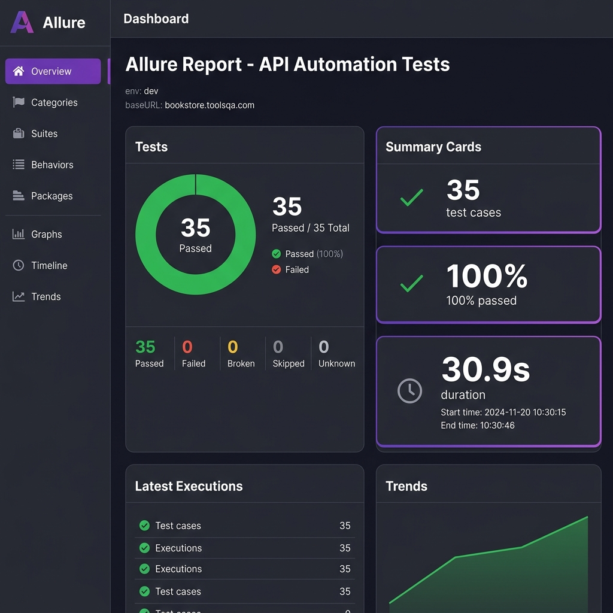
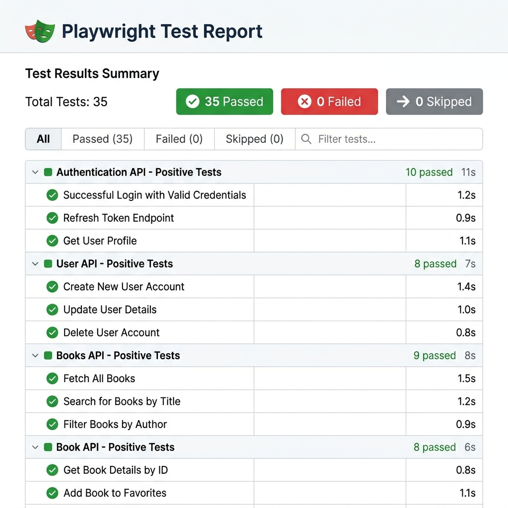
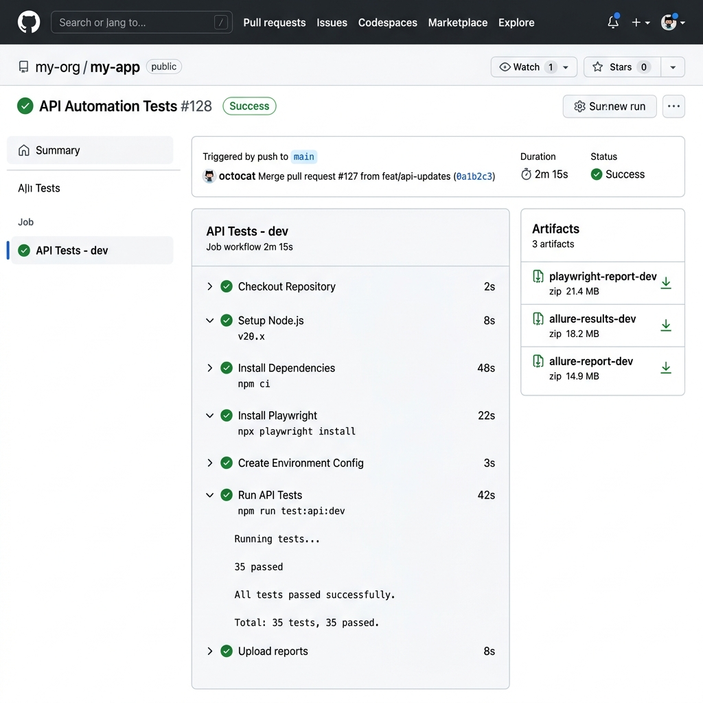

# 🚀 Playwright API Automation Framework

Enterprise-grade API automation framework built with **Playwright + TypeScript** for the [BookStore ToolsQA API](https://bookstore.toolsqa.com/swagger/).

## 📋 Table of Contents

- [Architecture](#architecture)
- [Prerequisites](#prerequisites)
- [Quick Start](#quick-start)
- [Framework Structure](#framework-structure)
- [Running Tests](#running-tests)
- [Environment Configuration](#environment-configuration)
- [Test Tags](#test-tags)
- [Reporting](#reporting)
- [Custom Matchers](#custom-matchers)
- [CI/CD Integration](#cicd-integration)
- [Best Practices](#best-practices)

---

## 🏗️ Architecture

```
┌─────────────────────────────────────────────┐
│                  Test Layer                 │
│  ┌──────────┐ ┌──────────┐ ┌──────────────┐ │
│  │ Positive │ │ Negative │ │   Security   │ │
│  │  Tests   │ │  Tests   │ │    Tests     │ │
│  └────┬─────┘ └────┬─────┘ └──────┬───────┘ │
│       └────────────┼──────────────┘         │
│                    │                        │
│            ┌───────┴────────┐               │
│            │    Fixtures    │               │
│            └───────┬────────┘               │
├────────────────────┼────────────────────────┤
│               Service Layer                 │
│  ┌──────────────┐  ┌───────────────────┐    │
│  │   Account    │  │    BookStore      │    │
│  │   Service    │  │    Service        │    │
│  └──────┬───────┘  └────────┬──────────     │
│         └──────────┬────────┘               │
│                    │                        │
├────────────────────┼────────────────────────┤
│             Infrastructure                  │
│  ┌──────────┐ ┌────────┐ ┌────────────────┐ │
│  │   API    │ │ Token  │ │    Schema      │ │
│  │  Client  │ │Manager │ │   Validator    │ │
│  └──────────┘ └────────┘ └────────────────┘ │
│  ┌──────────┐ ┌────────┐ ┌────────────────┐ │
│  │  Logger  │ │Request │ │  Data Provider │ │
│  │          │ │Builder │ │                │ │
│  └──────────┘ └────────┘ └────────────────┘ │
└─────────────────────────────────────────────┘
```

---

## ✅ Prerequisites

- **Node.js** >= 18.x
- **npm** >= 9.x
- **Git**

---

## 🚀 Quick Start

```bash
# 1. Clone the repository
git clone <repository-url>
cd "Playwright Automation - API"

# 2. Install dependencies
npm install

# 3. Install Playwright
npx playwright install

# 4. Run smoke tests on dev environment
npm run test:dev:smoke

# 5. Run all tests
npm run test:dev
```

---

## 📁 Framework Structure

```
├── src/
│   ├── config/          # Environment config & constants
│   ├── client/          # API client wrapper
│   ├── auth/            # Token management
│   ├── services/        # API service layer
│   ├── models/          # Request & response models
│   ├── schemas/         # JSON schemas for validation
│   ├── utils/           # Logger, helpers, data provider
│   ├── matchers/        # Custom Playwright matchers
│   └── fixtures/        # Test fixtures
├── tests/
│   ├── account/         # Account API tests
│   └── bookstore/       # BookStore API tests
├── test-data/
│   ├── dev/qa/cert/prod/  # Environment-specific data
│   ├── negative/          # Negative test payloads
│   └── common/            # Shared test data
├── env/                 # Environment configuration files
├── logs/                # Runtime logs
└── CI/CD configs        # GitHub Actions, Jenkins, Azure DevOps
```

---

## 🧪 Running Tests

### By Environment

```bash
npm run test:dev          # Run all tests on dev
npm run test:qa           # Run all tests on qa
npm run test:cert         # Run all tests on cert
npm run test:prod         # Run all tests on prod
```

### By Tags

```bash
npm run test:smoke        # Smoke tests only
npm run test:sanity       # Sanity tests only
npm run test:regression   # Full regression
npm run test:integration  # Integration tests
npm run test:security     # Security tests
npm run test:negative     # Negative tests
npm run test:contract     # Contract/schema tests
```

### Combined (Environment + Tags)

```bash
# Dev smoke tests
cross-env ENV=dev npx playwright test --grep @smoke

# QA regression
cross-env ENV=qa npx playwright test --grep @regression

# Run specific test file
npx playwright test tests/account/auth.positive.spec.ts

# Run with specific workers
npx playwright test --workers=2
```

### Custom Playwright CLI Options

```bash
# Run with headed browser (for debugging)
npx playwright test --headed

# Run with debug
npx playwright test --debug

# Run specific test by name
npx playwright test -g "should generate token"

# Run with retries
npx playwright test --retries=3
```

---

## 🌍 Environment Configuration

Environment files are in `env/` directory:

| File | Environment |
|------|-------------|
| `.env.dev` | Development |
| `.env.qa` | QA/Testing |
| `.env.cert` | Certification |
| `.env.prod` | Production |

### Configuration Variables

```env
BASE_URL=https://bookstore.toolsqa.com
ENV_NAME=dev
API_USERNAME=testuser_dev
API_PASSWORD=Test@12345
TOKEN_EXPIRY_BUFFER_MS=30000
LOG_LEVEL=debug
REQUEST_TIMEOUT=30000
RESPONSE_TIME_THRESHOLD=5000
MAX_WORKERS=4
```

---

## 🏷️ Test Tags

| Tag | Purpose |
|-----|---------|
| `@smoke` | Critical path tests, run frequently |
| `@sanity` | Basic functionality validation |
| `@regression` | Full regression suite |
| `@integration` | End-to-end integration tests |
| `@contract` | API schema/contract tests |
| `@security` | Security vulnerability tests |
| `@negative` | Negative/error scenario tests |

---

## 📊 Reporting

### Allure Report

Rich, interactive test reports with detailed request/response data, environment info, and trend analysis.

```bash
# Generate and open
npm run report:allure

# Generate only
npm run report:allure:generate

# Open existing report
npm run report:allure:open
```



### Playwright HTML Report

Built-in Playwright HTML report with test filtering, duration tracking, and failure details.

```bash
npm run report:html
```



### GitHub Actions CI

Automated test execution with report artifacts on every push, PR, or scheduled run.



### Report Features

| Feature | Playwright Report | Allure Report |
|---------|:-:|:-:|
| Test pass/fail summary | ✅ | ✅ |
| Request/response attachments | ❌ | ✅ |
| Environment information | ❌ | ✅ |
| Trend analysis | ❌ | ✅ |
| Failure screenshots | ✅ | ✅ |
| Duration tracking | ✅ | ✅ |
| Retry history | ✅ | ✅ |
| Categories & suites | ✅ | ✅ |

---

## 🔧 Custom Matchers

```typescript
// Status validation
expect(response).toHaveValidStatus(200);

// Schema validation
expect(response).toMatchSchema(bookSchema);

// Response time
expect(response).toHaveResponseTime(5000);

// Book content
expect(response).toContainBook('9781449325862');

// Token validation
expect(response).toHaveValidToken();
```

### Soft Assertions

```typescript
// Non-critical assertions that don't stop the test
expect.soft(response.headers['content-type']).toContain('application/json');
expect.soft(response.responseTime).toBeLessThan(3000);
```

---

## 🔄 CI/CD Integration

### GitHub Actions

Workflow file: `.github/workflows/api-tests.yml`

| Trigger | Environment | Description |
|---------|------------|-------------|
| Push to `main`/`develop` | `dev` (default) | Auto-runs on every push |
| Pull Request | `dev` (default) | Validates PR changes |
| Manual Dispatch | Dropdown: `dev` / `qa` / `cert` | On-demand with tag filtering |
| Nightly Schedule | `dev` (default) | Cron at 2 AM UTC |

**Manual Run:** Go to **Actions** → **API Automation Tests** → **Run workflow** → select environment and tags.

**Environment Secrets:** Configure per-environment credentials in **Settings** → **Environments** → add `API_USERNAME`, `API_PASSWORD`, `BASE_URL`.

---

## 💡 Best Practices

### Data Isolation
Each test creates its own user and operates on its own data. No shared mutable state between parallel workers.

### Token Management
Tokens are cached and auto-refreshed. The API client auto-retries on 401 responses with a fresh token.

### Logging
All API requests and responses are logged to `logs/api.log` with:
- Request URL, method, headers, body
- Response status, headers, body, time
- Timestamps and log levels

### Clean Architecture
```
Tests → Fixtures → Services → API Client → Playwright APIRequestContext
                                    ↓
                           Token Manager
                                    ↓
                              Logger + Allure
```

---

## 📝 License

MIT
